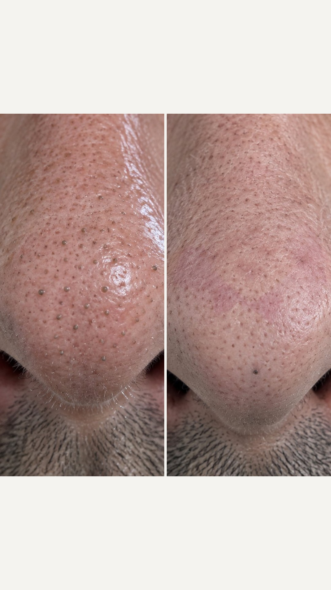

# LOS FOTOGRAMAS DE VUE SKIN: qué tienen, cuáles sirven de referencia y qué copiamos

**Versión 1.0 · 12 de septiembre de 2026.** Pediste usar fotogramas de Vue Skin como referencia. Esto es lo que
hay de verdad en el repositorio, para qué sirve cada cosa y para qué no.

## Qué hay y en qué estado

En `vue-skin-research/media/` están guardadas 3.050 imágenes de anuncios reales de Vue Skin. No son todas iguales
y la diferencia importa mucho:

| Qué es | Cuántas | Tamaño | ¿Sirve como referencia para el generador? |
|---|---|---|---|
| Hojas de fotogramas de anuncios en vídeo (nombre numérico) | ~2.600 | 480×428 la hoja entera | **No.** Cada fotograma dentro de la hoja mide unos 80 px. Es demasiado poco para que el modelo saque nada. Sirven para que **tú** estudies encuadres y ritmo, no para adjuntar. |
| Creatividades estáticas (nombre `img_…`) | 367 | 480×852, vertical 9:16 | **Sí, con matices.** 480 px de ancho da para guiar composición, luz y actitud. No da para detalle fino de piel. |
| Capturas de TikTok | 11 | pequeñas | No. |
| Google Ads | 20 | variadas | No, son banners. |

**La conclusión honesta:** los fotogramas de Vue sirven para decidir **qué plano hacer y cómo encuadrarlo**, no
para que el modelo copie textura. Para la textura del parche siguen mandando las fotos reales de nuestro producto,
que es lo único que hace que el troquel salga exacto.

## Las nueve referencias elegidas

Están copiadas en `img/referencias_vue/` para no tener que bucear entre 3.000 ficheros.

| Fichero | Qué enseña | Para qué toma nuestra |
|---|---|---|
| `vue_parche_usado_en_la_mano.jpg` | Dos manos sosteniendo el parche usado, blanco y nublado, a contraluz | Toma 12 de cualquier anuncio: el parche usado como prueba |
| `vue_parche_usado_delante_de_la_cara.jpg` | Una chica sostiene el parche usado delante de su cara, con la nariz limpia detrás | La toma 11 bis. Es **el plano estrella de Vue** |
| `vue_parche_usado_delante_de_la_cara_2.jpg` | El mismo plano con otra persona | Confirma que no es casualidad: lo repiten |
| `vue_antes_despues_dos_macros.jpg` | Dos macros de nariz lado a lado, «DAY 1 / MORNING 2» | Nuestras tomas 3 y 13, montadas juntas |
| `vue_antes_despues_dos_macros_2.jpg` | El mismo formato, otra persona | Lo mismo |
| `vue_comic_filamentos_sebaceos.jpg` | Ilustración tipo cómic, «SEBACEOUS FILAMENTS GONE» | Formato alternativo para el gancho educativo |
| `vue_ugc_selfie_espejo.jpg` | Selfie de espejo con el móvil en la mano, texto encima | Ganchos UGC |
| `vue_ugc_selfie_coche.jpg` | Selfie en el coche hablando a cámara | Ganchos UGC |
| `vue_caja_en_la_mano.jpg` | La caja sostenida sobre fondo liso | Entrada del producto |

## Los dos hallazgos que cambian lo que hacemos

**1. El plano estrella de Vue es el parche usado delante de la cara.** Aparece repetido en varias creatividades
distintas, con personas distintas, y siempre con la misma construcción: el parche usado sujeto con dos dedos a la
altura de la mejilla, ocupando un tercio del cuadro, y la nariz ya limpia detrás. Enseña las dos cosas a la vez —
lo que salió y cómo quedó — en un solo fotograma.

En nuestro anuncio 1 ese plano existe: es `img/a01/a01_11bis.jpg`, que había generado como recambio del despegado
a medias. **Deja de ser un recambio.** Es el plano que hay que tener en todos los anuncios, porque es el que la
competencia repite después de haberlo medido.

**2. El antes/después de dos macros se monta solo, sin gastar nada.** Vue publica una y otra vez una creatividad
estática con dos macros de nariz lado a lado y una franja de texto: «DAY 1 / MORNING 2». Nuestras tomas 3 y 13
están rodadas con el mismo encuadre y la misma luz precisamente para eso.

El montaje ya está hecho en `img/a01/creatividad_antes_despues.jpg`, a 1080×1920, con banda libre arriba y abajo
para que pongas tú el texto. No costó ni un crédito: son dos imágenes que ya teníamos.

Izquierda, la toma 3: poros con el tapón gris-marrón asomando y brillo de grasa. Derecha, la toma 13: los mismos
poros vacíos y planos, la piel mate, y un solo punto oscuro que queda a propósito para que el resultado sea creíble.

## Qué copiamos de Vue y qué no

**Copiamos:** el plano del parche usado delante de la cara; el antes/después de dos macros con encuadre idéntico;
la estética de móvil sin retocar; poner el texto encima en el montaje y nunca dentro de la imagen generada; y dejar
un punto oscuro en el «después», porque una nariz perfecta no se la cree nadie.

**No copiamos:** el fondo degradado de estudio con los botes flotando, que es su lenguaje de marca y no el nuestro;
las ilustraciones tipo cómic, que en España leen como anuncio barato; ni los rótulos de «40% OFF» permanentes, que
queman la marca. Nuestro packshot va sobre mármol crema y con luz de ventana, que es lo que ya está definido en la
biblia visual.

## Cómo usar una referencia de Vue en un prompt

No se adjunta un anuncio de Vue como `image_references` para que el modelo copie el producto: nuestro parche tiene
su propia forma y para eso están las fotos reales de nuestro producto. La referencia de Vue se usa de otra manera:

1. Mira el fotograma y anota tres cosas: **a qué distancia está la cámara**, **de dónde viene la luz** y **qué hace
   cada mano**.
2. Escribe esas tres cosas en el prompt con números. «Sostiene el parche usado con el pulgar y el índice a la
   altura del pómulo, a 25 cm de la cámara, luz de ventana por la izquierda» vale; «como en la referencia» no vale.
3. Adjunta las fotos de **nuestro** producto, no la de Vue.

Es la diferencia entre copiar la dirección de fotografía, que es legítimo y útil, y copiar el producto, que además
de ser mala idea saldría mal.
