# Anuncio 1 · Si tu nariz se ve así

[Volver al índice de los 25 anuncios](../PROMPTS_375_TOMAS.md)

**Avatar.** Álex, 36 (pelo corto oscuro, barba de tres días, cicatriz pequeña en la ceja derecha, nariz claramente grasa con filamentos oscuros, rojez en las mejillas, camiseta gris oscuro). El guion dice «Todos (sin identidad explícita)» porque la frase no menciona edad ni sexo: la identidad la pone la nariz. Por eso hay que elegir UNA nariz y la de Álex es la única de los tres avatares con filamentos visibles a 15 cm, que es lo que el segundo 0 tiene que demostrar. No se le ve la cara entera hasta la toma 2; el resto son macros, así que el anuncio sigue sirviendo para los tres públicos.

**Sitio y luz.** Sitio principal: BAÑO DE DÍA (sitio 1 de la biblia) — azulejo blanco tipo metro, grifo cromado, luz de ventana suave por la izquierda, 10:00. Es donde ocurren las tomas 1 a 9 (gancho, diagnóstico, error, entrada del producto), porque el guion pide macro «con luz de ventana» ya en el segundo 0 y esa luz lateral suave es la única que dibuja los filamentos sin quemar el brillo de la zona T. El mismo baño cambia de luz dos veces dentro del anuncio, no de sitio: BAÑO DE NOCHE (sitio 2, plafón cenital duro, 23:30) para la colocación del parche del bloque 16–24 s («antes de dormir»), y luz de ventana de mañana (sitio 4, lateral limpia, 07:40) para la retirada, el parche a contraluz y la nariz después. Solo el cierre sale del baño: MESA DE MÁRMOL CREMA (sitio 5) para el pack de 2 del bloque 32–38 s. Cuatro estados de luz, un solo azulejo: así el montaje lee como una sola noche y no como cuatro rodajes.

**Continuidad (lo que se repite en las 15 tomas).** ROPA (en todas las tomas donde se le vea): camiseta gris oscuro de algodón, cuello redondo algo dado de sí, sin estampado, sin cuello de camisa debajo. La misma prenda de día, de noche y por la mañana — es lo que hace que el anuncio parezca una noche seguida y no cuatro días. PELO: corto oscuro sin peinar, con un remolino sobre la sien derecha; a partir de la toma 11 (mañana) aparece aplastado por un lado, por la almohada, y ya se queda así hasta el final. BARBA: tres días, igual en las 15 (no crece ni se afeita). MARCAS FIJAS: cicatriz pequeña cruzando la ceja derecha, capilares rojos en los pómulos, un granito en curación cerca de la mandíbula izquierda, uñas cortas con un padrastro en el pulgar derecho, vello oscuro en los nudillos. SIN: reloj, pulseras, anillos, gafas, maquillaje. ATREZO QUE SE REPITE EN EL FONDO: toalla blanca colgada a la derecha del lavabo, grifo cromado, vaso con cepillo azul en la balda, dos botes de exfoliante en esa misma balda (visibles desenfocados en las tomas 6 y 7). HORAS: 10:00 en las tomas 1–9, 23:30 en la 10, 07:40–07:50 en las 11–13, 11:00 en las 14–15. EL PARCHE: mariposa de 60x45 mm, hidrocoloide traslúcido mate, borde biselado, 0,55 mm. Limpio = casi transparente con velo mate (tomas 9 y 10). Usado = blanco opaco por islas con puntitos blancos y amarillentos (tomas 11 y 12). Nunca tira negra, nunca círculo, nunca dibujos.

**Orden de montaje.** Las 15 van en orden 1 → 15, con una sola excepción: la toma 2 NO se monta, es la variante A/B del gancho. Se exportan dos versiones del anuncio idénticas salvo el primer plano (versión A arranca con la 1, versión B con la 2) y se dejan compitiendo.

Línea de tiempo de la versión A, 38 s:
· 0,0-2,0 s — Toma 1 (macro con el dedo señalando). La voz entra en el fotograma 1, sin silencio previo: «Si tu nariz se ve así de cerca...». Subtítulo NO SON PUNTOS NEGROS en grande.
· 2,0-4,0 s — Toma 3 (nariz de frente, sin dedo). Cierra la frase: «...no tienes puntos negros». Corte seco entre 1 y 3, sin transición.
· 4,0-7,0 s — Toma 4 (macro extremo de los poros). «Se llaman filamentos sebáceos: grasa que tu piel fabrica sola...»
· 7,0-10,0 s — Toma 5 (brillo rasante). «...y que se rellena cada día». Subtítulo FILAMENTOS = grasa que se rellena.
· 10,0-13,0 s — Toma 6 (la tira usada). «Nada te ha funcionado porque los tratabas como puntos negros».
· 13,0-16,0 s — Toma 7 (apretar y rojez). «Por eso vuelven siempre». Subtítulo Por eso vuelven. Aquí va el único golpe de sonido del anuncio si se usa alguno.
· 16,0-18,0 s — Toma 8 (caja y sobre). «Este parche está hecho para eso...». Es el corte más importante del montaje: se pasa del problema al producto sin bajar el ritmo, plano corto de 2 s.
· 18,0-21,0 s — Toma 9 (parche traslúcido en macro). «...absorbe la grasa desde dentro del poro...»
· 21,0-24,0 s — Toma 10 (colocación, baño de noche). «...mientras duermes, en vez de arrancarte la piel como las tiras». Subtítulo Absorbe. No arranca. El salto de luz día→noche hace el trabajo de la elipsis, no hace falta fundido.
· 24,0-27,0 s — Toma 11 (retirada lenta). «Por la mañana lo ves en el parche». Subtítulo Mira lo que sale entrando aquí y quedándose sobre la 12.
· 27,0-30,0 s — Toma 12 (parche a contraluz). «Todo eso estaba dentro». Deja el plano correr entero: es el que retiene.
· 30,0-32,0 s — Toma 13 (nariz después, encuadre clavado de la 3). «Y a las tres semanas casi no se notan». Si puedes, mete medio segundo de la toma 3 justo antes, en un flash de antes/después; con el mismo encuadre el efecto es instantáneo.
· 32,0-35,0 s — Toma 14 (móvil con la garantía). «Y si no te convence, te devolvemos el dinero». Subtítulo Si no se pega, te lo cambiamos · 60 días.
· 35,0-38,0 s — Toma 15 (packshot del pack de 2). «Pack de 2 cajas, 29,90 €, envío gratis desde España». El último fotograma se congela 0,5 s con el precio en pantalla.

Notas de montaje: todos los cortes son secos, sin fundidos ni transiciones; la voz se graba entera de una vez y se monta primero, y los planos se ajustan a ella, no al revés. El audio de los vídeos generados va a cero en todos los casos. Los 15 clips se generan a 3 s aunque el montaje use menos: sobra material por los dos extremos para ajustar al fraseo.


## Las 15 imágenes de este anuncio, ya generadas

Este es el único anuncio cuyas imágenes están generadas y verificadas una a una. Sirven de patrón de calidad para los otros 24: si una imagen tuya no se parece a estas, el fallo está en el prompt o en las referencias adjuntas, no en el modelo. Debajo de cada una está el prompt EXACTO con el que se generó y las fotos que se le adjuntaron. No es una reconstrucción: es lo que se envió a GPT Image 2.5.

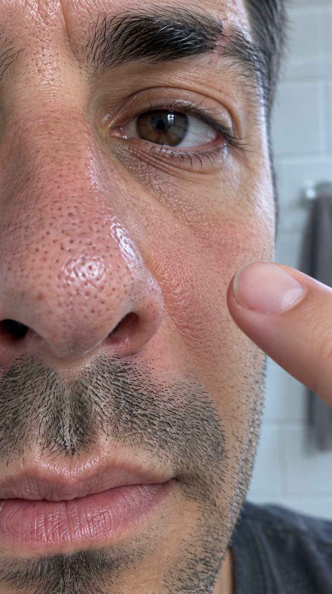

**Toma 1 — Gancho A · la nariz a 15 cm con el dedo señalando**

Referencias adjuntas: avatar (Álex). Ajustes: 1k · medium · 9:16.

```text
Vertical 9:16 handheld iPhone photo, extreme macro with a clip-on macro lens. Álex, 36, short dark hair, three-day stubble, charcoal grey crew-neck t-shirt at the bottom edge; frame filled by the right ala and tip of his nose from 15 cm. Enlarged pores with grey-brown sebaceous filament plugs inside each one, fine vellus hair, thin red capillaries in the nostril crease, oily sheen on the bridge, uneven skin tone. His index fingertip enters from the right and points at the ala without touching it. Day bathroom, white subway tile behind, soft north-facing window light from the left, 10:00. Very shallow depth of field, focus exactly on the pores of the ala, slight handheld motion blur at the edges, natural digital sensor noise. No beauty retouching, no skin smoothing, no makeup, unretouched documentary realism. No text, no logos, no watermark.
```

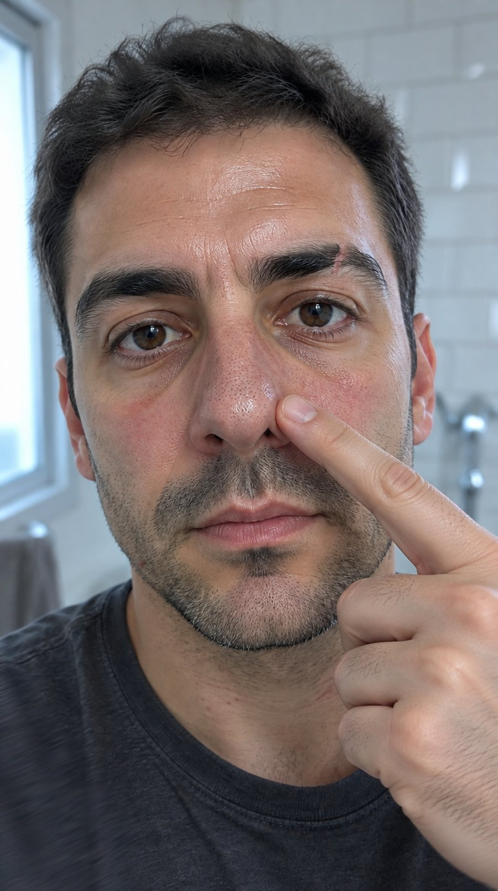

**Toma 2 — Gancho B · el mismo momento desde más lejos, mirando a cámara**

Referencias adjuntas: avatar (Álex). Ajustes: 1k · medium · 9:16.

```text
Vertical 9:16 handheld iPhone photo. Álex, 36, short dark hair with a cowlick over the right temple, three-day stubble, small scar through the right eyebrow, charcoal grey crew-neck t-shirt with a stretched collar; head and shoulders three-quarter view from 40 cm, eyes to the lens. Visibly oily nose with dark filaments across both alae, red capillaries on the cheeks, one healing spot near the left jaw, uneven skin tone, shiny forehead. He taps the side of his own nose once with his index finger. Day bathroom, white subway tile, chrome tap out of focus behind, soft north-facing window light from the left, 10:00. Very shallow depth of field, focus exactly on the nose, slight handheld motion blur at the edges, natural digital sensor noise. No beauty retouching, no skin smoothing, no makeup, unretouched documentary realism. No text, no logos, no watermark.
```

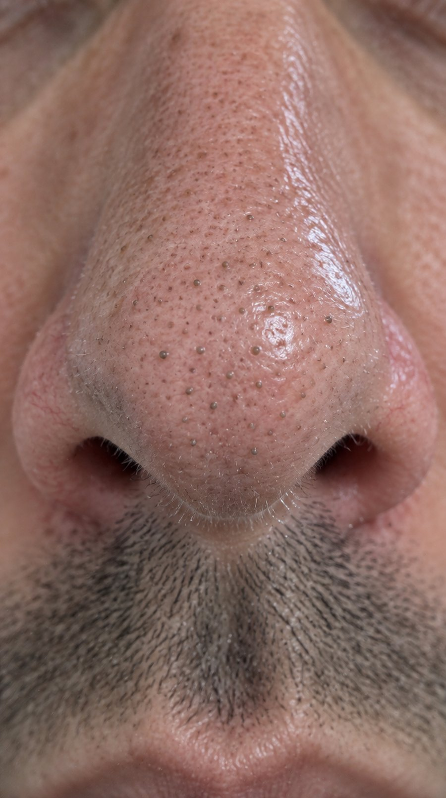

**Toma 3 — Diagnóstico · la nariz entera de frente, sin dedo**

Referencias adjuntas: avatar (Álex). Ajustes: 1k · medium · 9:16.

```text
Vertical 9:16 handheld iPhone photo, macro with a clip-on macro lens. Álex, 36, short dark hair, three-day stubble, charcoal grey crew-neck t-shirt at the bottom edge; the nose fills the frame straight on from 20 cm, both alae and the tip, eyes and mouth cropped out. Dozens of enlarged pores in an uneven field over the tip, grey-brown sebaceous filament plugs, a few standing slightly proud of the skin, fine vellus hair catching the light, thin red capillaries along the nostril creases, oily sheen on the bridge, uneven skin tone. He holds still and breathes out. Day bathroom, white subway tile, soft north-facing window light from the left, 10:00. Very shallow depth of field, focus exactly on the tip of the nose, slight handheld motion blur at the edges, natural digital sensor noise. No beauty retouching, no skin smoothing, no makeup, unretouched documentary realism. No text, no logos, no watermark.
```

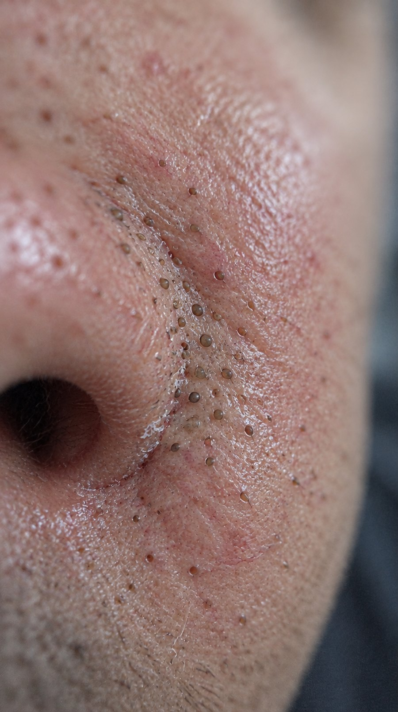

**Toma 4 — Detalle del problema · tres centímetros cuadrados de aleta**

Referencias adjuntas: avatar (Álex). Ajustes: 1k · medium · 9:16.

```text
Extreme macro photograph shot on an iPhone with a clip-on macro lens, handheld. Three square centimetres of a 36-year-old man's left nasal ala fill the whole frame; no other feature is recognisable, a charcoal grey t-shirt blurred far behind. Around forty enlarged pores scattered in a completely IRREGULAR, uneven distribution: clustered in two or three dense patches along the nostril crease and sparse elsewhere, every pore a different size and a different angle, never aligned in rows or a grid, never evenly spaced. Most hold a grey-brown sebaceous filament plug with a slightly domed tip, a few are empty and open, several are stretched into short slits. Fine colourless vellus hairs lying flat across the skin, thin red capillaries, a few dry flakes at the nostril crease, an oily film between the pores, uneven reddish blotchy skin tone. The skin stays still. Day bathroom, soft north-facing window light from the left, 10:00. Very shallow depth of field, focus exactly on one dense cluster of pores slightly off-centre, the rest falling out of focus, slight handheld motion blur at the edges, natural digital sensor noise, visible grain. No beauty retouching, no skin smoothing, no makeup, unretouched documentary realism, not a 3D render. No text, no logos, no watermark.
```

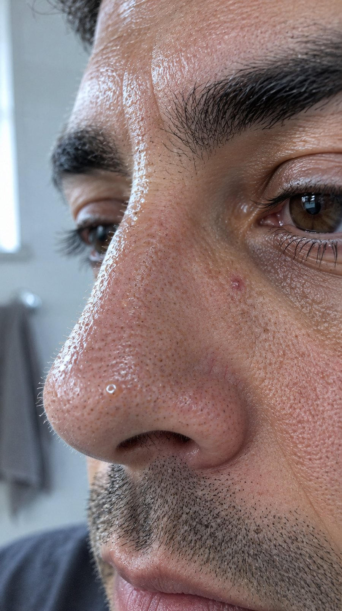

**Toma 5 — La grasa que se rellena · el puente a contraluz rasante**

Referencias adjuntas: avatar (Álex). Ajustes: 1k · medium · 9:16.

```text
Vertical 9:16 handheld iPhone photo, macro with a clip-on macro lens. Álex, 36, short dark hair, three-day stubble, charcoal grey crew-neck t-shirt; the bridge of his nose and the inner corner of the right eye from 15 cm, seen almost edge-on along the surface of the skin. A long specular strip of oil lies on the bridge, tiny beads of sebum sit at the pore mouths, grey-brown filament plugs, fine vellus hair standing up against the light, thin red capillaries beside the nostril, one healing spot below the inner eye corner, uneven skin tone. He blinks once. Day bathroom, white subway tile, raking north-facing window light from the left, 10:00. Very shallow depth of field, focus exactly on the oily strip, slight handheld motion blur at the edges, natural digital sensor noise. No beauty retouching, no skin smoothing, no makeup, unretouched documentary realism. No text, no logos, no watermark.
```

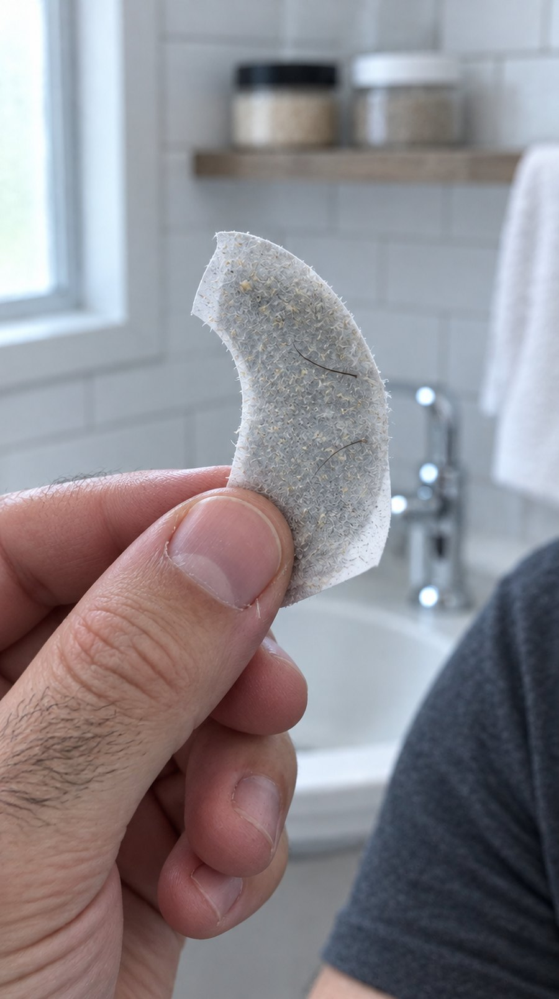

**Toma 6 — El error 1 · la tira de farmacia recién arrancada**

Referencias adjuntas: avatar (Álex). Ajustes: 1k · medium · 9:16.

```text
Vertical 9:16 handheld iPhone photo, close shot. A 36-year-old man's hand, short nails, a hangnail on the thumb, dark hair on the back of the fingers, charcoal grey t-shirt sleeve at the edge of frame; he holds a just-removed pharmacy pore strip between thumb and index finger at 25 cm, the strip curled and stiff. Its sticky side is matted with grey fibres, a dusting of dead skin, three fine hairs pulled out, only a couple of tiny plugs, nothing dramatic. Behind, out of focus, a chrome tap, a white towel and two unlabelled scrub jars on a shelf. Day bathroom, white subway tile, soft north-facing window light from the left, 10:00. Very shallow depth of field, focus exactly on the sticky side of the strip, slight handheld motion blur at the edges, natural digital sensor noise. No beauty retouching, unretouched documentary realism. No text, no logos, no watermark.
```

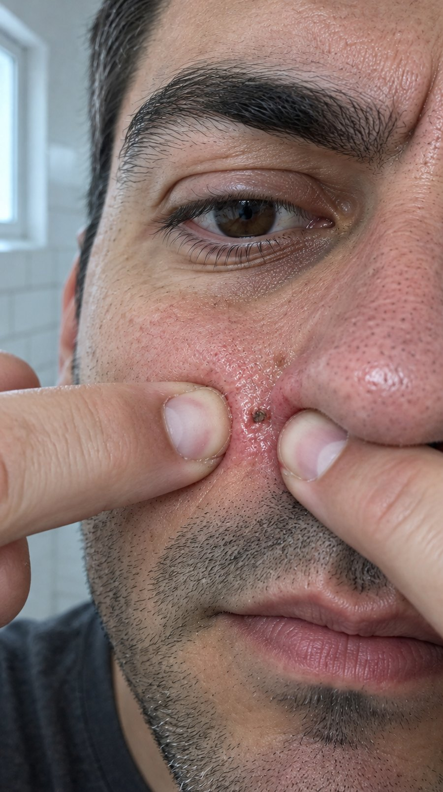

**Toma 7 — El error 2 · apretar, y la rojez inmediata**

Referencias adjuntas: avatar (Álex). Ajustes: 1k · medium · 9:16.

```text
Vertical 9:16 handheld iPhone photo, macro with a clip-on macro lens. Álex, 36, short dark hair, three-day stubble, charcoal grey crew-neck t-shirt; his two index fingertips press hard on either side of the left nasal ala from 18 cm, the skin pinched between the nails. The skin under the nails is blanched white, a hot red ring is already spreading around it, one pore is torn and wet-looking, tiny scratches from the nail edges, grey-brown filament plugs still sitting in the untouched pores, fine vellus hair, thin red capillaries, uneven skin tone. He squeezes and holds. Day bathroom, white subway tile, soft north-facing window light from the left, 10:00. Very shallow depth of field, focus exactly on the pinched skin, slight handheld motion blur at the edges, natural digital sensor noise. No beauty retouching, no skin smoothing, no makeup, unretouched documentary realism. No text, no logos, no watermark.
```

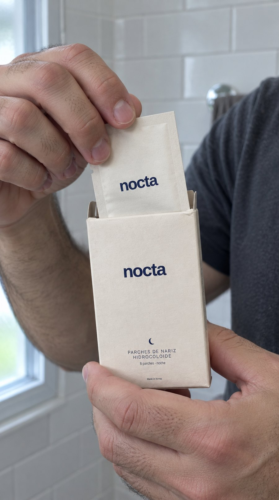

**Toma 8 — Entrada del producto · la caja en la mano y el sobre saliendo**

Referencias adjuntas: avatar (Álex), caja real. Ajustes: 1k · medium · 9:16.

```text
The box must be EXACTLY the product in the reference photographs: same matte cream carton, same printed layout. Do not invent a different design. Vertical 9:16 handheld iPhone photo, close shot from 30 cm. A 36-year-old man's left hand, short nails, dark hair on the knuckles, charcoal grey t-shirt sleeve in frame, holds the matte cream uncoated cardboard NOCTA box the size of a deck of cards at chest height; his right hand pulls a small matte cream sachet halfway out of it. Visible paper fibre on the board, one soft dent in the corner, no gloss anywhere, fingerprints on the skin, thin red capillaries on the knuckles. Day bathroom, white subway tile behind, soft north-facing window light from the left, 10:00. Very shallow depth of field, focus exactly on the sachet leaving the box, slight handheld motion blur at the edges, natural digital sensor noise. No beauty retouching, unretouched documentary realism. No added text beyond what is printed on the box, no invented logos, no watermark.
```

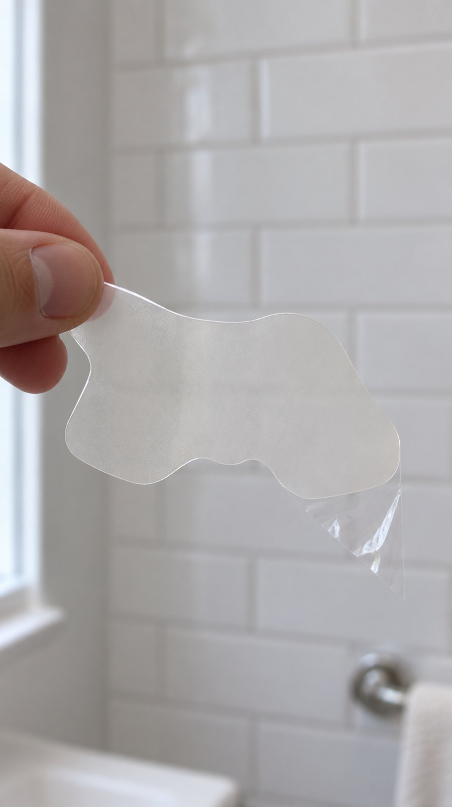

**Toma 9 — El parche fuera del sobre · mariposa traslúcida a 10 cm**

Referencias adjuntas: parche real sobre su liner, parche real puesto en la nariz. Ajustes: 1k · medium · 9:16.

```text
The patch must be EXACTLY the product in the reference photographs: same silhouette, same proportions, same translucent matte material. Do not invent a different shape. COMPOSITION IS CRITICAL: the ENTIRE patch is inside the frame, complete, with empty space on all four sides; nothing is cropped by the frame edge; the whole butterfly outline must be readable at a glance. Vertical 9:16 handheld iPhone photo from 20 cm. A man's thumb and index fingertip pinch one wing of a translucent matte hydrocolloid nose patch and hold the whole piece up in the air: one wide central lobe and two symmetrical side wings that spread sideways and downwards, a shallow rounded notch in the middle of the lower edge, every corner rounded, 60 mm wide, 0.55 mm thick with a bevelled edge catching a thin line of light. The piece sags slightly under its own weight and one corner is still lifted off its shiny transparent release liner, which hangs below. The material is almost clear with a fine matte veil; the tiled wall is visible straight through it, faint dust specks on the surface. Day bathroom, white subway tile out of focus behind, soft north-facing window light from the left, 10:00. Shallow depth of field, focus exactly on the bevelled edge of the near wing, slight handheld motion blur, natural digital sensor noise, unretouched documentary realism. Never opaque, never black, never a straight strip, never an oval. No text, no logos, no watermark.
```

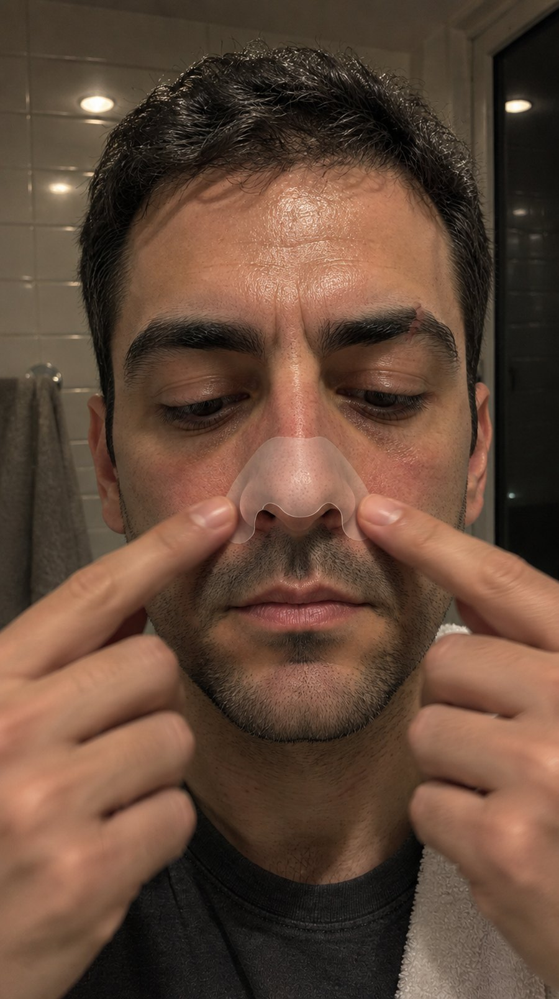

**Toma 10 — Colocación · las dos yemas presionando diez segundos, de noche**

Referencias adjuntas: avatar (Álex), parche real puesto en la nariz, parche real puesto, segundo ángulo. Ajustes: 1k · medium · 9:16.

```text
The patch must be EXACTLY the product in the reference photographs: same silhouette, same proportions, same translucent matte material. Do not invent a different shape. IT IS NIGHT: the only light is a hard ceiling fixture directly overhead, so there are short hard shadows straight down under the brow, the nose and the lower lip, the tops of the cheekbones are bright and the eye sockets are dark, and the small window behind is pure black with the tiles reflected in it. No daylight, no soft window light, no blue sky. Vertical 9:16 handheld iPhone photo from 35 cm. A man of 36, short dark hair, three-day stubble, small scar through the right eyebrow, a charcoal grey crew-neck t-shirt, a white towel over his left shoulder; he presses a translucent matte butterfly hydrocolloid patch onto his clean dry nose with both index fingers, one on each wing, eyes down, mouth relaxed. Tired shadows under the eyes, red capillaries on the cheeks, damp hairline. The patch is already sealed and conforms to the curve of the nose and to both nostril wings with no wrinkles and no lifted corners, one shade paler than the skin, a thin line of light along the bevelled edge, the pores faintly readable through the film. Night bathroom, white subway tile, 23:30. Shallow depth of field, focus exactly on the patch, slight handheld motion blur at the edges, natural digital sensor noise, warm tungsten colour cast. No beauty retouching, no skin smoothing, no makeup, unretouched documentary realism. No text, no logos, no watermark.
```

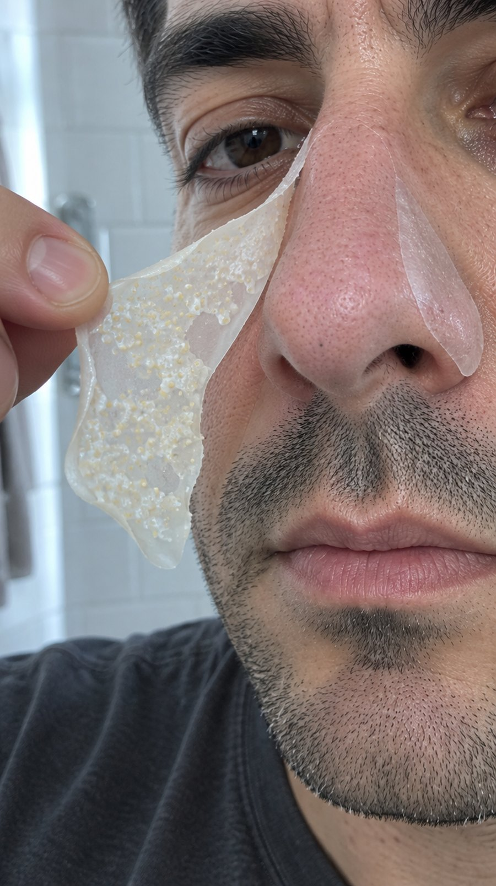

**Toma 11 — Retirada · el ala del parche levantándose por la mañana**

Referencias adjuntas: avatar (Álex), nariz limpia ya generada (toma 13), parche real sobre su liner. Ajustes: 1k · medium · 9:16.

```text
Three reference photographs are attached. The FIRST is the man's face: keep his identity. The SECOND is his nose AFTER the treatment: the skin of the nose in the image you generate must look EXACTLY like that second reference, with open EMPTY pores and no dark dots. The THIRD is the product: the patch must keep that silhouette and translucent matte material. Vertical 9:16 handheld iPhone photo, three-quarter view, macro from 20 cm, the nose in the middle of the frame and the eye only clipped at the top edge. A man of 36, three-day stubble, hair flattened on one side by the pillow, charcoal grey crew-neck t-shirt. He is peeling the hydrocolloid patch off his nose in one continuous sheet: the right portion is still stuck flat and translucent on the right side of the nose, and without any break it lifts along one single boundary down the ridge and hangs from his thumb and index finger at the left, curled, limp, its underside turned to the camera. That underside is covered in irregular opaque milky-white islands studded with dozens of small raised white and pale-yellow domes, the plugs pulled out of the pores. CRITICAL: the front and the left side of the nose are now UNCOVERED and CLEAN, exactly like the second reference photograph: the pores are open, EMPTY, flat and pale, there are NO dark dots, NO grey-brown plugs and NO blackheads anywhere on that skin, only a faint pink adhesive mark and a slight dampness. Morning window light from the left, white subway tile out of focus behind, 07:40. Shallow depth of field, focus on the boundary between the stuck and the peeled part, slight handheld motion blur, natural digital sensor noise, unretouched documentary realism, no beauty retouching, no skin smoothing. No text, no logos, no watermark.
```

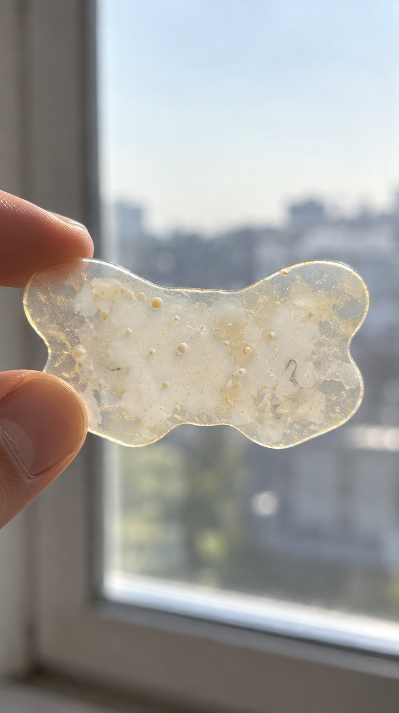

**Toma 12 — La prueba · el parche usado a contraluz**

Referencias adjuntas: parche real sobre su liner, parche real puesto en la nariz. Ajustes: 1k · medium · 9:16.

```text
The patch must be EXACTLY the product in the reference photographs: same silhouette, same proportions, same material. Do not invent a different shape. COMPOSITION IS CRITICAL: the ENTIRE used patch is inside the frame, complete, with empty space on all four sides; nothing is cropped by the frame edge; the whole butterfly outline must be readable at a glance, one wide central lobe, two symmetrical side wings, a shallow rounded notch in the middle of the lower edge, every corner rounded. Vertical 9:16 handheld iPhone photo from 25 cm. A man's thumb and index finger pinch one wing and hold the used hydrocolloid patch up flat against a bright window, backlit. Where it sat over the pores it has turned opaque milky white in irregular islands, with dozens of small raised white and pale-yellow domes and a few grey-brown threads stretched inside the film; the outer border of the piece is still translucent amber and the bevelled edge reads as a thin bright line; one wing is slightly stretched and the piece keeps the memory of the curve of a nose, its edges curling in. Out-of-focus window frame and pale sky behind. Morning window light coming from behind the patch, 07:45. Shallow depth of field, focus exactly on the white domes, slight handheld motion blur, natural digital sensor noise, unretouched documentary realism. Never black, never a straight strip, never an oval, never a shapeless blob. No text, no logos, no watermark.
```

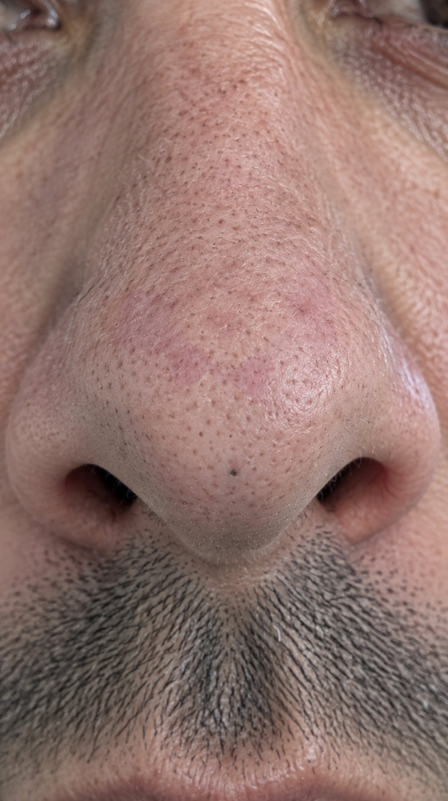

**Toma 13 — Nariz después · el mismo encuadre de la toma 3**

Referencias adjuntas: avatar (Álex). Ajustes: 1k · medium · 9:16.

```text
FRAMING IS CRITICAL: extreme macro, the nose alone fills the whole vertical frame from 20 cm, straight on, tip and both nostril wings edge to edge; the eyes and the mouth are OUTSIDE the frame or only just clipped at the border. Not a portrait, not a head and shoulders. Vertical 9:16 handheld iPhone photo with a clip-on macro lens. A 36-year-old man, short dark hair flattened on one side by the pillow, three-day stubble at the bottom edge of the frame. The pores of the nose are still clearly visible but EMPTY and flat: the grey-brown sebaceous plugs are gone from all of them except one near the tip that still holds a dark plug. The surface is matte, not oily, with a faint pink butterfly-shaped mark where the adhesive sat, fine vellus hair, thin red capillaries in the nostril crease, uneven blotchy skin tone. No patch on the nose and no patch anywhere in the frame. Morning window light, lateral and clean, white subway tile behind and out of focus, 07:50. Shallow depth of field, focus exactly on the tip of the nose, slight handheld motion blur at the edges, natural digital sensor noise. No beauty retouching, no skin smoothing, no makeup, unretouched documentary realism. No text, no logos, no watermark.
```

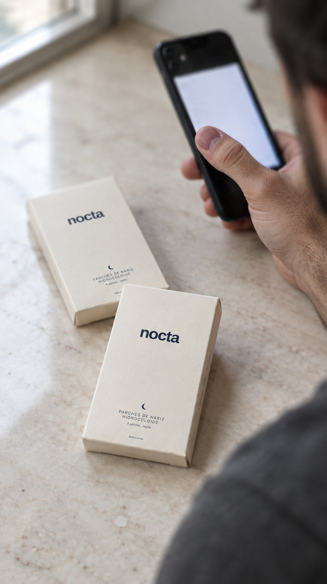

**Toma 14 — Garantía · el móvil y el pack de 2 en el mármol**

Referencias adjuntas: caja real. Ajustes: 1k · medium · 9:16.

```text
The cream cardboard boxes must be EXACTLY the product in the reference photograph: same matte uncoated cream board, same proportions, same printing. Do not invent different packaging and do not add any text beyond what is printed on the box in the reference. Vertical 9:16 handheld iPhone photo from 40 cm, over the shoulder. A man's hand, short nails, dark hair on the knuckles, a charcoal grey t-shirt sleeve in frame, holds a black phone tilted away from the camera so the screen is only a pale sheet of blown-out light with nothing readable on it; two matte cream cardboard boxes lie in the foreground beside his forearm. Fingerprints and a small scratch on the phone back, dust specks on the stone, a hangnail on the thumb. Cream marble table, soft window light from the left, short shadow, 11:00. Very shallow depth of field, focus exactly on the front box, the phone screen out of focus, slight handheld motion blur at the edges, natural digital sensor noise, unretouched documentary realism. No added text, no logos beyond the box, no watermark.
```

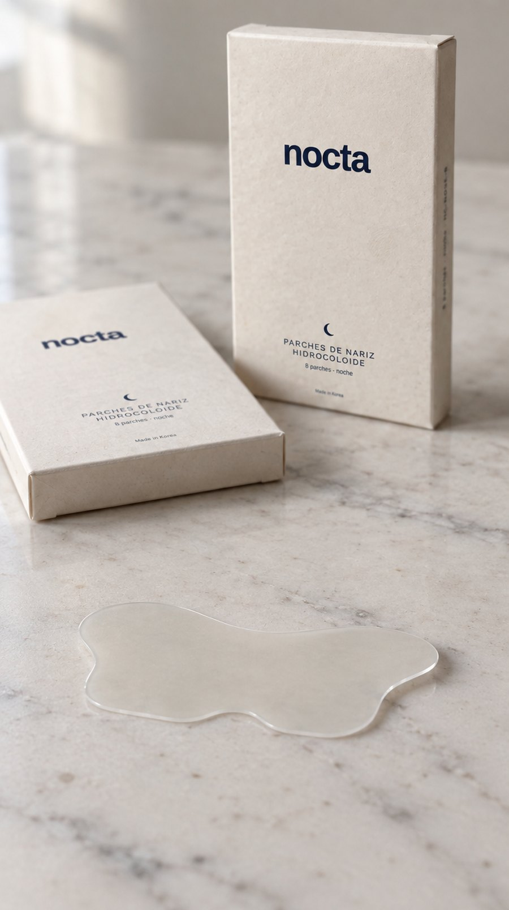

**Toma 15 — Cierre · packshot del pack de 2 con un parche al lado**

Referencias adjuntas: parche real sobre su liner, caja real. Ajustes: 1k · medium · 9:16.

```text
The box and the patch must be EXACTLY the products in the reference photographs: same cream matte uncoated board and printing, same patch silhouette and translucent matte material. Do not add text beyond what is printed on the box in the reference. THE PATCH IS THE HERO OF THE FOREGROUND and must be large and fully visible: a clean translucent butterfly-shaped hydrocolloid nose patch lying flat on the marble in the near foreground, complete inside the frame with space around it, seen from slightly above so its whole die-cut outline reads at a glance: one wide central lobe, two symmetrical side wings spreading sideways and down, a shallow rounded notch in the middle of the lower edge, every corner rounded. It is a solid 0.55 mm sheet of film, not a liquid, not a puddle, not a spill, not crumpled cling film and not a limp noodle: its bevelled edge catches a thin line of light, one wing is lifted a few millimetres off the stone and casts a small sharp shadow under it. Vertical 9:16 handheld iPhone photo from 35 cm. Behind it, two matte cream uncoated cardboard boxes on a cream marble table, one standing and one lying flat, slightly out of focus. Visible paper fibre on the board, a soft dent in one corner, a faint thumbprint on the lid, dust specks and grey veining in the marble, no gloss anywhere. Nobody in frame. Soft window light from the left, short soft shadow to the right, 11:00. Shallow depth of field, focus exactly on the patch, slight handheld motion blur, natural digital sensor noise, unretouched documentary realism. No added text, no watermark.
```

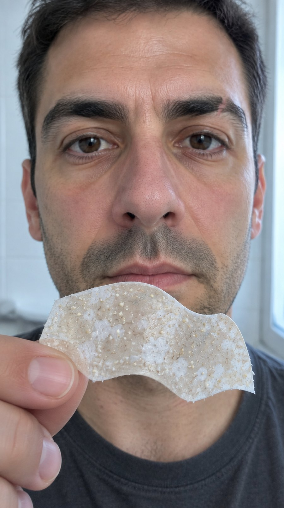

**Toma 11 bis — Alternativa a la toma 11 · el parche ya fuera, delante de la nariz limpia**

Referencias adjuntas: avatar (Álex), nariz limpia ya generada (toma 13), parche real sobre su liner. Ajustes: 1k · medium · 9:16.

```text
Three reference photographs are attached. The FIRST is the man's face: keep his identity. The SECOND is his nose AFTER the treatment: the skin of the nose you generate must look EXACTLY like that second reference, open EMPTY pores, no dark dots. The THIRD is the product. Vertical 9:16 handheld iPhone photo, macro from 20 cm, straight on, the nose filling the middle of the frame, eyes clipped at the top edge. A man of 36, three-day stubble, hair flattened by the pillow, charcoal grey t-shirt. The patch is now COMPLETELY OFF his nose: he holds the whole used piece between thumb and index finger just in front of and slightly below his nose, tilted toward the camera so its inner face is fully visible, soft and curling at the edges, keeping the memory of the curve of the nose. Its inner face is covered in irregular opaque milky-white islands studded with dozens of small raised white and pale-yellow domes and a few grey-brown threads stretched in the film. Behind it his nose is bare, with NO patch on it and no patch residue: the pores are open, EMPTY and flat, there are NO dark dots and NO grey-brown plugs anywhere, the surface is matte instead of oily and a faint pink butterfly-shaped mark shows where the adhesive sat. Morning window light, lateral and clean, white subway tile out of focus, 07:45. Shallow depth of field, focus on the used patch with the nose slightly softer behind it, slight handheld motion blur, natural digital sensor noise, unretouched documentary realism, no beauty retouching. No text, no logos, no watermark.
```

> La toma 11 bis es el plano de recambio: el parche ya fuera, sujeto delante de la nariz limpia. Sale bien a la primera mucho más a menudo que el despegado a medias y enseña las dos cosas en un solo fotograma, las manchas blancas y la nariz sin puntos.


## El anuncio entero en un prompt para copiar y pegar

Esto es el anuncio completo en 2 bloque(s), con los cortes duros dentro del propio prompt. Es el formato que entiende el generador de vídeo: un clip con varios cortes sale más barato y mucho más consistente que generar los planos sueltos y pegarlos después. Se adjuntan como referencia la foto del personaje, la del parche real y la de la caja, y se usan las imágenes de las tomas como fotogramas de arranque de cada corte.

**Bloque 1 · tomas 1 a 8 · unos 20 s**

```text
Vertical 9:16 handheld iPhone UGC ad, shot on a phone in one take and cut 7 times.
IDENTITY LOCK: the same person, the same clothes, the same hair and the same room in every cut, exactly as in the attached reference photographs. Nobody else appears.
PRODUCT LOCK: the patch is the product in the attached reference photographs. Same silhouette, same proportions, same translucent matte material. It never changes shape, never turns opaque black, never becomes a straight strip or an oval, and the box never shows text that is not printed on the reference box.
HANDS: in every cut, each visible hand has one job and only one; a hand that is not acting stays out of frame. No mirrors, no reflections, no phone visible in frame.
PACE: each cut is one single action, held steady, no zoom inside a cut unless the cut asks for it.
No on-screen text, no subtitles, no captions, no logos, no watermark. No music and no dialogue: silent.

Cut 1: The index fingertip moves two centimetres closer to the ala and stops, without touching the skin
Hard cut to.
Cut 2: He taps the side of his nose once with his index finger and lowers the hand
Hard cut to.
Cut 3: The nose stays still and only the nostrils widen slightly with one slow exhale
Hard cut to.
Cut 4: A single very slow push in of about five per cent towards the central row of pores, nothing else moves
Hard cut to.
Cut 5: He blinks once, slowly, and the specular strip of oil on the bridge shifts a few millimetres with the movement
Hard cut to.
Cut 6: He tilts the used strip a few degrees towards the window so the light crosses its sticky side, one single movement of the wrist
Hard cut to.
Cut 7: The two fingertips press a little harder and then release, and the blanched skin floods back to red where they were
Hard cut to.
Cut 8: The right hand slides the sachet fully out of the box in one continuous movement and stops
End on the last frame and hold it. No fades, no dissolves, no transitions of any kind: every change of shot is a hard cut.
```

**Bloque 2 · tomas 9 a 15 · unos 20 s**

```text
Vertical 9:16 handheld iPhone UGC ad, shot on a phone in one take and cut 6 times.
IDENTITY LOCK: the same person, the same clothes, the same hair and the same room in every cut, exactly as in the attached reference photographs. Nobody else appears.
PRODUCT LOCK: the patch is the product in the attached reference photographs. Same silhouette, same proportions, same translucent matte material. It never changes shape, never turns opaque black, never becomes a straight strip or an oval, and the box never shows text that is not printed on the reference box.
HANDS: in every cut, each visible hand has one job and only one; a hand that is not acting stays out of frame. No mirrors, no reflections, no phone visible in frame.
PACE: each cut is one single action, held steady, no zoom inside a cut unless the cut asks for it.
No on-screen text, no subtitles, no captions, no logos, no watermark. No music and no dialogue: silent.

Cut 1: The patch flexes once as the fingers turn it a few degrees and the light slides along its bevelled edge
Hard cut to.
Cut 2: He presses down on both wings of the patch with his index fingers and slowly lifts the fingers away, leaving the patch stuck to the nose
Hard cut to.
Cut 3: The fingers peel the patch two centimetres further off the nose, very slowly, and the white underside turns towards the camera
Hard cut to.
Cut 4: The fingers tilt the used patch a few degrees against the window so the backlight crosses the white domes and they read one by one
Hard cut to.
Cut 5: The nose stays still and only one slow exhale widens the nostrils a couple of millimetres
Hard cut to.
Cut 6: The thumb makes one short scroll movement on the phone screen while the rest of the frame stays still
Hard cut to.
Cut 7: A very slow pull back of about eight per cent that reveals a little more of the marble around the two boxes
End on the last frame and hold it. No fades, no dissolves, no transitions of any kind: every change of shot is a hard cut.
```

**Avisos de este anuncio (planos seguidos que el generador puede fundir en vez de cortar):**

- Las tomas 3 y 4 están en la misma banda de distancia (macro) y van seguidas: el generador tiende a fundirlas en vez de cortar. Cambia el encuadre de una de las dos o separa los planos en el montaje.
- Las tomas 4 y 5 están en la misma banda de distancia (macro) y van seguidas: el generador tiende a fundirlas en vez de cortar. Cambia el encuadre de una de las dos o separa los planos en el montaje.
- Las tomas 12 y 13 están en la misma banda de distancia (macro) y van seguidas: el generador tiende a fundirlas en vez de cortar. Cambia el encuadre de una de las dos o separa los planos en el montaje.
- Las tomas 14 y 15 están en la misma banda de distancia (primer plano) y van seguidas: el generador tiende a fundirlas en vez de cortar. Cambia el encuadre de una de las dos o separa los planos en el montaje.

> A 12 de estas 15 tomas se les ha añadido automáticamente alguna de las reglas comprobadas (fidelidad del producto, encuadre completo del parche, nariz limpia, poros irregulares, física del despegado o consecuencias de la luz de noche). Van al principio del prompt y están marcadas en la línea «Reglas añadidas».


## Las 15 tomas, una a una

### Toma 1 · Gancho A · la nariz a 15 cm con el dedo señalando

*0-4 s · gancho «Si tu nariz se ve así de cerca, no tienes puntos negros»*

**Qué se ve.** Macro del ala derecha y la punta de la nariz llenando todo el cuadro. Se ven los poros dilatados uno a uno, con el tapón gris-marrón dentro de cada uno, el vello fino y el brillo de grasa en el puente. El dedo índice entra por la derecha y señala el ala sin llegar a tocarla. Es el primer fotograma del anuncio: lo que decide si se quedan o pasan.

**Referencias que hay que adjuntar:** `avatar` — la foto del personaje (Bea / Marisol / Álex, según el anuncio)

**Reglas añadidas:** regla de poros irregulares

**Prompt de imagen (GPT Image 2.5, 9:16):**

```text
The pores are scattered in a completely IRREGULAR, uneven distribution, clustered in two or three dense clusters and sparse elsewhere, every pore a different size and a different angle, never aligned in rows or a grid, never evenly spaced. Vertical 9:16 handheld iPhone photo, extreme macro with a clip-on macro lens. Álex, 36, short dark hair, three-day stubble, charcoal grey crew-neck t-shirt at the bottom edge; frame filled by the right ala and tip of his nose from 15 cm. Enlarged pores with grey-brown sebaceous filament plugs inside each one, fine vellus hair, thin red capillaries in the nostril crease, oily sheen on the bridge, uneven skin tone. His index fingertip enters from the right and points at the ala without touching it. Day bathroom, white subway tile behind, soft north-facing window light from the left, 10:00. Very shallow depth of field, focus exactly on the pores of the ala, slight handheld motion blur at the edges, natural digital sensor noise. No beauty retouching, no skin smoothing, no makeup, unretouched documentary realism. No text, no logos, no watermark.
```

**Prompt de vídeo (imagen a vídeo, 2 s):**

```text
The image comes alive: the index fingertip moves two centimetres closer to the ala and stops, without touching the skin. Static handheld camera with micro-drift. Slow, calm pace, no cuts. The pores, the filament plugs and the nose must keep exactly the same shape and position; the person's face and the product must not change shape. No text, no subtitles, no watermark. Silent.
```

> **Nota de producción.** Es LA toma del anuncio: si esta imagen no parece una foto real de móvil, no hay anuncio. Genera 6-8 variantes y quédate con la que tenga los poros más desiguales (los generadores tienden a repartirlos como una cuadrícula). Cuando llegue el lote, esta se regraba de verdad con la lente macro de 8 €: una nariz real a 15 cm gana siempre.

### Toma 2 · Gancho B · el mismo momento desde más lejos, mirando a cámara

*0-4 s · gancho (variante A/B, no va en el montaje junto a la 1)*

**Qué se ve.** Cabeza y hombros en tres cuartos a 40 cm, mirando al objetivo, tocándose el lateral de la nariz con el índice. Se le ve la cara entera: barba de tres días, cicatriz en la ceja, rojez en los pómulos, y la nariz brillante con los filamentos oscuros. Misma frase, mismo segundo, distancia distinta: es la variante para el test A/B del gancho.

**Referencias que hay que adjuntar:** `avatar` — la foto del personaje (Bea / Marisol / Álex, según el anuncio)

**Prompt de imagen (GPT Image 2.5, 9:16):**

```text
Vertical 9:16 handheld iPhone photo. Álex, 36, short dark hair with a cowlick over the right temple, three-day stubble, small scar through the right eyebrow, charcoal grey crew-neck t-shirt with a stretched collar; head and shoulders three-quarter view from 40 cm, eyes to the lens. Visibly oily nose with dark filaments across both alae, red capillaries on the cheeks, one healing spot near the left jaw, uneven skin tone, shiny forehead. He taps the side of his own nose once with his index finger. Day bathroom, white subway tile, chrome tap out of focus behind, soft north-facing window light from the left, 10:00. Very shallow depth of field, focus exactly on the nose, slight handheld motion blur at the edges, natural digital sensor noise. No beauty retouching, no skin smoothing, no makeup, unretouched documentary realism. No text, no logos, no watermark.
```

**Prompt de vídeo (imagen a vídeo, 2 s):**

```text
The image comes alive: he taps the side of his nose once with his index finger and lowers the hand. Static handheld camera with micro-drift. Two seconds, one gesture, nothing else moves. The person's face and the shape of his nose must not change; no morphing of the eyes or mouth. No text, no subtitles, no watermark. Silent.
```

> **Nota de producción.** No se monta seguida de la 1: es su alternativa. Exporta dos versiones del anuncio, una arrancando con la 1 y otra con la 2, y deja que decida el CTR. Ojo con la cicatriz de la ceja: el generador la pierde o la convierte en corte fresco; si sale mal, vale más quitarla del prompt que tener una herida.

### Toma 3 · Diagnóstico · la nariz entera de frente, sin dedo

*0-4 s · cierre del gancho, la nariz sola en pantalla*

**Qué se ve.** Macro frontal a 20 cm: la nariz llena el cuadro, las dos aletas y la punta, sin ojos ni boca. Un campo entero de poros con tapones gris-marrón, algunos sobresaliendo un poco. Es la imagen que se repetirá clavada en la toma 13 para el antes/después, así que el encuadre se anota y no se cambia.

**Referencias que hay que adjuntar:** `avatar` — la foto del personaje (Bea / Marisol / Álex, según el anuncio)

**Reglas añadidas:** regla de poros irregulares

**Prompt de imagen (GPT Image 2.5, 9:16):**

```text
The pores are scattered in a completely IRREGULAR, uneven distribution, clustered in two or three dense clusters and sparse elsewhere, every pore a different size and a different angle, never aligned in rows or a grid, never evenly spaced. Vertical 9:16 handheld iPhone photo, macro with a clip-on macro lens. Álex, 36, short dark hair, three-day stubble, charcoal grey crew-neck t-shirt at the bottom edge; the nose fills the frame straight on from 20 cm, both alae and the tip, eyes and mouth cropped out. Dozens of enlarged pores in an uneven field over the tip, grey-brown sebaceous filament plugs, a few standing slightly proud of the skin, fine vellus hair catching the light, thin red capillaries along the nostril creases, oily sheen on the bridge, uneven skin tone. He holds still and breathes out. Day bathroom, white subway tile, soft north-facing window light from the left, 10:00. Very shallow depth of field, focus exactly on the tip of the nose, slight handheld motion blur at the edges, natural digital sensor noise. No beauty retouching, no skin smoothing, no makeup, unretouched documentary realism. No text, no logos, no watermark.
```

**Prompt de vídeo (imagen a vídeo, 2 s):**

```text
The image comes alive: the nose stays still and only the nostrils widen slightly with one slow exhale. Static handheld camera with micro-drift, no push in. Very slow pace. The pores and the filament plugs must keep the same positions and the nose must not change shape. No text, no subtitles, no watermark. Silent.
```

> **Nota de producción.** Guarda la semilla y el encuadre exactos: la toma 13 es esta misma imagen con la nariz limpia. Si el par 3/13 no casa milimétricamente, el antes/después se cae y con él la mitad del anuncio.

### Toma 4 · Detalle del problema · tres centímetros cuadrados de aleta

*4-10 s · «Se llaman filamentos sebáceos: grasa que tu piel fabrica sola»*

**Qué se ve.** Macro extremo, tan cerca que ya no se reconoce que es una nariz: solo piel, unos cuarenta poros, y dentro de cada uno un cilindro gris-marrón con la punta abombada. Algunos poros vacíos y abiertos. Es la prueba visual de que no son puntos negros sino canales llenos.

**Referencias que hay que adjuntar:** `avatar` — la foto del personaje (Bea / Marisol / Álex, según el anuncio); `nariz_limpia` — un fotograma ya generado de esa misma nariz limpia (obligatorio en tomas de «después»)

**Reglas añadidas:** regla de nariz limpia; referencia nariz_limpia; regla de poros irregulares

**Prompt de imagen (GPT Image 2.5, 9:16):**

```text
The reference photograph of the clean nose is what the skin must look like: the pores are open, EMPTY and flat, there are NO dark dots and NO grey-brown plugs anywhere on the uncovered skin, only a faint pink adhesive mark. The pores are scattered in a completely IRREGULAR, uneven distribution, clustered in two or three dense clusters and sparse elsewhere, every pore a different size and a different angle, never aligned in rows or a grid, never evenly spaced. Extreme macro photograph shot on an iPhone with a clip-on macro lens, handheld. Three square centimetres of Álex's left nasal ala fill the whole frame; no other feature is recognisable, the charcoal grey t-shirt blurred far behind. Around forty enlarged pores, each holding a grey-brown sebaceous filament plug with a slightly domed tip, some pores empty and open, fine colourless vellus hairs lying across the skin, thin red capillaries, dry flakes at the nostril crease, an oily film between the pores, uneven reddish skin tone. The skin stays still. Day bathroom, soft north-facing window light from the left, 10:00. Very shallow depth of field, focus exactly on the row of pores in the centre, slight handheld motion blur at the edges, natural digital sensor noise. No beauty retouching, no skin smoothing, no makeup, unretouched documentary realism. No text, no logos, no watermark.
```

**Prompt de vídeo (imagen a vídeo, 3 s):**

```text
The image comes alive: a single very slow push in of about five per cent towards the central row of pores, nothing else moves. Handheld with micro-drift. Slow and steady. The pores, the filament plugs and the vellus hairs must keep their exact shape and number; nothing may morph or slide. No text, no subtitles, no watermark. Silent.
```

> **Nota de producción.** El generador tiende a ordenar los poros en retícula y a ponerlos todos del mismo tamaño: descarta esas. Esta toma también gana grabada de verdad, pero necesita trípode improvisado y luz de ventana fuerte porque a esa distancia el móvil se mueve un milímetro y se va de foco.

### Toma 5 · La grasa que se rellena · el puente a contraluz rasante

*4-10 s · «...y que se rellena cada día»*

**Qué se ve.** Macro del puente de la nariz visto casi a ras de piel: una franja larga de brillo de grasa, con gotitas de sebo asomando en la boca de los poros y el vello fino de punta contra la luz. Es la imagen del «se fabrica sola»: no hay suciedad, hay aceite.

**Referencias que hay que adjuntar:** `avatar` — la foto del personaje (Bea / Marisol / Álex, según el anuncio)

**Prompt de imagen (GPT Image 2.5, 9:16):**

```text
Vertical 9:16 handheld iPhone photo, macro with a clip-on macro lens. Álex, 36, short dark hair, three-day stubble, charcoal grey crew-neck t-shirt; the bridge of his nose and the inner corner of the right eye from 15 cm, seen almost edge-on along the surface of the skin. A long specular strip of oil lies on the bridge, tiny beads of sebum sit at the pore mouths, grey-brown filament plugs, fine vellus hair standing up against the light, thin red capillaries beside the nostril, one healing spot below the inner eye corner, uneven skin tone. He blinks once. Day bathroom, white subway tile, raking north-facing window light from the left, 10:00. Very shallow depth of field, focus exactly on the oily strip, slight handheld motion blur at the edges, natural digital sensor noise. No beauty retouching, no skin smoothing, no makeup, unretouched documentary realism. No text, no logos, no watermark.
```

**Prompt de vídeo (imagen a vídeo, 3 s):**

```text
The image comes alive: he blinks once, slowly, and the specular strip of oil on the bridge shifts a few millimetres with the movement. Static handheld camera with micro-drift. Calm pace, one blink only. The face and the nose must not change shape and the eye must not deform while closing. No text, no subtitles, no watermark. Silent.
```

> **Nota de producción.** La luz rasante es todo: si la ventana queda de frente en vez de a 80 grados, desaparece el brillo y la toma no dice nada. Si el generador no da el reflejo, gírale el prompt a «light skimming across the skin from the far left». Grabada de verdad sale a la primera.

### Toma 6 · El error 1 · la tira de farmacia recién arrancada

*10-16 s · «Nada te ha funcionado porque los tratabas como puntos negros»*

**Qué se ve.** La mano de Álex sujeta entre pulgar e índice una tira de poros ya usada, curvada y tiesa. En la cara pegajosa: pelusa gris, piel muerta, dos o tres pelillos arrancados y apenas un par de taponcitos. Poco botín y mucho estropicio. Al fondo desenfocado, la balda con los botes de exfoliante.

**Referencias que hay que adjuntar:** `avatar` — la foto del personaje (Bea / Marisol / Álex, según el anuncio)

**Prompt de imagen (GPT Image 2.5, 9:16):**

```text
Vertical 9:16 handheld iPhone photo, close shot. Álex's hand, short nails, a hangnail on the thumb, dark hair on the back of the fingers, charcoal grey t-shirt sleeve at the edge of frame; he holds a just-removed pharmacy pore strip between thumb and index finger at 25 cm, the strip curled and stiff. Its sticky side is matted with grey fibres, a dusting of dead skin, three fine hairs pulled out, only a couple of tiny plugs, nothing dramatic. Behind, out of focus, a chrome tap, a white towel and two unlabelled scrub jars on a shelf. Day bathroom, white subway tile, soft north-facing window light from the left, 10:00. Very shallow depth of field, focus exactly on the sticky side of the strip, slight handheld motion blur at the edges, natural digital sensor noise. No beauty retouching, unretouched documentary realism. No text, no logos, no watermark.
```

**Prompt de vídeo (imagen a vídeo, 3 s):**

```text
The image comes alive: he tilts the used strip a few degrees towards the window so the light crosses its sticky side, one single movement of the wrist. Static handheld camera with micro-drift. Slow. The hand and the strip must not change shape and the debris on the strip must not multiply or move. No text, no subtitles, no watermark. Silent.
```

> **Nota de producción.** Honesto: esta se graba de verdad. La tira cuesta 3 € y una tira usada real tiene una textura que el generador no acierta — o la deja limpia o la llena de puntos negros de dibujo animado. Además los botes del fondo saldrán con marcas inventadas; en el prompt van «unlabelled» y aun así hay que comprobarlo o dejarlos fuera de cuadro.

### Toma 7 · El error 2 · apretar, y la rojez inmediata

*10-16 s · «Por eso vuelven siempre»*

**Qué se ve.** Macro de dos yemas apretando a los lados del ala izquierda, con la piel pinzada entre las uñas: blanca bajo la presión y con un cerco rojo caliente alrededor, un poro desgarrado y brillante y arañazos finos del borde de la uña. La consecuencia del error en la misma imagen que el error.

**Referencias que hay que adjuntar:** `avatar` — la foto del personaje (Bea / Marisol / Álex, según el anuncio)

**Reglas añadidas:** regla de poros irregulares

**Prompt de imagen (GPT Image 2.5, 9:16):**

```text
The pores are scattered in a completely IRREGULAR, uneven distribution, clustered in two or three dense clusters and sparse elsewhere, every pore a different size and a different angle, never aligned in rows or a grid, never evenly spaced. Vertical 9:16 handheld iPhone photo, macro with a clip-on macro lens. Álex, 36, short dark hair, three-day stubble, charcoal grey crew-neck t-shirt; his two index fingertips press hard on either side of the left nasal ala from 18 cm, the skin pinched between the nails. The skin under the nails is blanched white, a hot red ring is already spreading around it, one pore is torn and wet-looking, tiny scratches from the nail edges, grey-brown filament plugs still sitting in the untouched pores, fine vellus hair, thin red capillaries, uneven skin tone. He squeezes and holds. Day bathroom, white subway tile, soft north-facing window light from the left, 10:00. Very shallow depth of field, focus exactly on the pinched skin, slight handheld motion blur at the edges, natural digital sensor noise. No beauty retouching, no skin smoothing, no makeup, unretouched documentary realism. No text, no logos, no watermark.
```

**Prompt de vídeo (imagen a vídeo, 3 s):**

```text
The image comes alive: the two fingertips press a little harder and then release, and the blanched skin floods back to red where they were. One single squeeze. Static handheld camera with micro-drift. The nose must not change shape and the fingers must not multiply or bend unnaturally. No text, no subtitles, no watermark. Silent.
```

> **Nota de producción.** Cuidado con pasarse de gore: si sale sangre o costra, la plataforma lo penaliza y el anuncio deja de parecer un consejo para parecer una advertencia médica. Rojez y piel blanca bajo la uña, nada más. Se graba de verdad sin problema: apretar y soltar delante del móvil son diez segundos.

### Toma 8 · Entrada del producto · la caja en la mano y el sobre saliendo

*16-24 s · «Este parche está hecho para eso»*

**Qué se ve.** Plano corto de las dos manos: la izquierda sujeta la caja de cartón crema mate del tamaño de una baraja, la derecha tira del sobrecito individual hasta sacarlo a medias. Todavía no se ve el parche. Cartón sin brillo, una esquina algo abollada, huellas en la piel.

**Referencias que hay que adjuntar:** `avatar` — la foto del personaje (Bea / Marisol / Álex, según el anuncio); `caja` — la foto real de la caja crema de NOCTA

**Reglas añadidas:** cláusula de fidelidad de la caja

**Prompt de imagen (GPT Image 2.5, 9:16):**

```text
The box must be EXACTLY the product in the reference photograph: same matte cream uncoated board, same proportions, same printing, and no added text beyond what is printed on it. Vertical 9:16 handheld iPhone photo, close shot from 30 cm. Álex's left hand, short nails, dark hair on the knuckles, charcoal grey t-shirt sleeve in frame, holds a matte cream uncoated cardboard box the size of a deck of cards at chest height; his right hand pulls a small matte cream sachet halfway out of it. Visible paper fibre on the board, one soft dent in the corner, no gloss anywhere, fingerprints on the skin, thin red capillaries on the knuckles. Day bathroom, white subway tile behind, soft north-facing window light from the left, 10:00. Very shallow depth of field, focus exactly on the sachet leaving the box, slight handheld motion blur at the edges, natural digital sensor noise. No beauty retouching, unretouched documentary realism. No text, no logos, no watermark.
```

**Prompt de vídeo (imagen a vídeo, 2 s):**

```text
The image comes alive: the right hand slides the sachet fully out of the box in one continuous movement and stops. Static handheld camera with micro-drift. Slow, two seconds of movement. The box must keep its exact proportions and the printing on it must not change or multiply; the hands must not deform. No text, no subtitles, no watermark. Silent.
```

> **Nota de producción.** Aquí la coletilla «no text, no logos» convive con una caja que sí lleva logotipo: el logotipo entra por la imagen de referencia, la coletilla es para que no invente rótulos ni marcas de agua encima. Aun así, el 70 % de las generaciones deforma las letras de la caja. Truco: encuadrar con el pulgar tapando media tapa. Cuando llegue el lote, este plano se regraba con la caja real y se acabó el problema.

### Toma 9 · El parche fuera del sobre · mariposa traslúcida a 10 cm

*16-24 s · «absorbe la grasa desde dentro del poro»*

**Qué se ve.** Macro extremo del parche entre el pulgar y el índice: la mariposa de 60 mm, lóbulo central y dos alas, traslúcida con velo mate, el borde biselado y los 0,55 mm de grosor. Se ven las huellas dactilares y un capilar rojo a través del material. Una esquina despegada del liner.

**Referencias que hay que adjuntar:** `parche_liner` — la foto real del parche sobre su liner, junto a la caja; `caja` — la foto real de la caja crema de NOCTA; `parche_puesto` — la foto real del parche colocado en la nariz

**Reglas añadidas:** cláusula de fidelidad del parche; referencia parche_puesto; regla de encuadre completo del parche

**Prompt de imagen (GPT Image 2.5, 9:16):**

```text
The patch must be EXACTLY the product in the reference photographs: same silhouette, same proportions, same translucent matte material. Do not invent a different shape. COMPOSITION IS CRITICAL: the ENTIRE patch is inside the frame, complete, with empty space on all four sides; nothing is cropped by the frame edge; the whole butterfly outline must be readable at a glance: one wide central lobe, two symmetrical side wings and a shallow rounded notch in the middle of the lower edge, every corner rounded. Never a straight strip, never an oval, never a shapeless blob, never black. Extreme macro photograph shot on an iPhone with a clip-on macro lens, handheld. Álex's thumb and index fingertip hold a translucent matte hydrocolloid nose patch shaped like a butterfly, one central lobe and two side wings, 60 mm wide, 0.55 mm thick with a bevelled edge; it fills the frame at 10 cm and bends slightly under its own weight. The material is almost clear with a fine matte veil, the fingerprint ridges and a thin red capillary are visible straight through it, one corner still lifted off the release liner, faint dust specks on the surface. Day bathroom, white subway tile out of focus, soft north-facing window light from the left, 10:00. Very shallow depth of field, focus exactly on the bevelled edge, slight handheld motion blur, natural digital sensor noise, unretouched documentary realism. No text, no logos, no watermark.
```

**Prompt de vídeo (imagen a vídeo, 3 s):**

```text
The image comes alive: the patch flexes once as the fingers turn it a few degrees and the light slides along its bevelled edge. One movement of the wrist only. Static handheld camera with micro-drift, slow. The butterfly shape, the two wings and the thickness of the patch must not change; it must never become a round dot or a dark strip. No text, no subtitles, no watermark. Silent.
```

> **Nota de producción.** La toma con más riesgo de todo el anuncio junto con la 12: sin la lámina técnica adjunta, el modelo devuelve un círculo de grano o una tira negra tipo Bioré. Adjunta SIEMPRE la lámina y repite hasta que se vean las dos alas y el bisel. Si al llegar el lote hay un parche real, esta y la 12 son las dos primeras que hay que regrabar.

### Toma 10 · Colocación · las dos yemas presionando diez segundos, de noche

*16-24 s · «mientras duermes, en vez de arrancarte la piel como las tiras»*

**Qué se ve.** Plano de cara a 35 cm en el baño de noche, con el plafón cenital duro marcando ojeras. Álex, toalla blanca al hombro, presiona el parche sobre la nariz limpia y seca con los dos índices, uno en cada ala. El parche ya se adapta a la aleta y se vuelve un poco más claro donde toca.

**Referencias que hay que adjuntar:** `avatar` — la foto del personaje (Bea / Marisol / Álex, según el anuncio); `parche_liner` — la foto real del parche sobre su liner, junto a la caja; `parche_puesto` — la foto real del parche colocado en la nariz

**Reglas añadidas:** cláusula de fidelidad del parche; consecuencias de la luz de noche

**Prompt de imagen (GPT Image 2.5, 9:16):**

```text
The patch must be EXACTLY the product in the reference photographs: same silhouette, same proportions, same translucent matte material. Do not invent a different shape. IT MUST READ AS NIGHT: everything beyond the light source falls into real darkness, any window in shot is black, the shadows are short and hard with almost no fill, and there is heavy sensor noise in the shadows. No daylight, no soft window light, no blue sky. Vertical 9:16 handheld iPhone photo from 35 cm. Álex, 36, short dark hair, three-day stubble, small scar through the right eyebrow, the same charcoal grey crew-neck t-shirt, a white towel over his left shoulder; he presses a translucent matte butterfly hydrocolloid patch onto his clean dry nose with both index fingers, one on each wing, eyes down, mouth relaxed. Tired shadows under the eyes, red capillaries on the cheeks, damp hairline, the patch already conforming to the ala and turning slightly clearer where it touches the skin. Night bathroom, white subway tile, hard ceiling light from above, 23:30. Very shallow depth of field, focus exactly on the patch, slight handheld motion blur at the edges, natural digital sensor noise. No beauty retouching, no skin smoothing, no makeup, unretouched documentary realism. No text, no logos, no watermark.
```

**Prompt de vídeo (imagen a vídeo, 3 s):**

```text
The image comes alive: he presses down on both wings of the patch with his index fingers and slowly lifts the fingers away, leaving the patch stuck to the nose. One single action. Static handheld camera with micro-drift, slow. His face and the butterfly shape of the patch must not change shape and the patch must stay in exactly the same place. No text, no subtitles, no watermark. Silent.
```

> **Nota de producción.** Es el único plano nocturno del anuncio y carga él solo con el «mientras duermes»: si la luz no es claramente de plafón cenital y con ojeras, el espectador no entiende que ha caído la noche. No metas dos acciones (pegar y presionar) en el mismo vídeo: se deforman los dedos. Genera la imagen con el parche ya puesto y anima solo la presión.

### Toma 11 · Retirada · el ala del parche levantándose por la mañana

*24-32 s · «Por la mañana lo ves en el parche»*

**Qué se ve.** Macro a 20 cm con luz de mañana: pulgar e índice despegan el parche, el ala derecha ya levantada y curvándose, todavía pegado por el puente. En la cara interna que asoma se ve el blanco opaco por zonas y los puntitos amarillentos. Pelo aplastado por la almohada, marca de la funda en el pómulo.

**Referencias que hay que adjuntar:** `avatar` — la foto del personaje (Bea / Marisol / Álex, según el anuncio); `parche_liner` — la foto real del parche sobre su liner, junto a la caja; `parche_puesto` — la foto real del parche colocado en la nariz; `nariz_limpia` — un fotograma ya generado de esa misma nariz limpia (obligatorio en tomas de «después»)

**Reglas añadidas:** cláusula de fidelidad del parche; física del despegado; regla de nariz limpia; referencia nariz_limpia; regla de poros irregulares; 1 regla(s) omitida(s) por longitud

**Prompt de imagen (GPT Image 2.5, 9:16):**

```text
The patch must be EXACTLY the product in the reference photographs: same silhouette, same proportions, same translucent matte material. Do not invent a different shape. PHYSICS OF THE PEEL: he peels the patch off in ONE CONTINUOUS SHEET. One part is still stuck flat and translucent on the nose and, without any break, it lifts along ONE single boundary and hangs from his fingers, curled and limp, its underside turned to the camera. There is no patch material anywhere over skin that has already been uncovered. That underside shows irregular opaque milky-white islands studded with dozens of small raised white and pale-yellow domes, the plugs pulled out of the pores. The reference photograph of the clean nose is what the skin must look like: the pores are open, EMPTY and flat, there are NO dark dots and NO grey-brown plugs anywhere on the uncovered skin, only a faint pink adhesive mark. Vertical 9:16 handheld iPhone photo, macro from 20 cm. Álex, 36, short dark hair flattened on one side from the pillow, three-day stubble, the same charcoal grey crew-neck t-shirt, a pillow crease on the right cheek; his thumb and index finger peel the hydrocolloid butterfly patch off his nose, the right wing already lifted and curling while the centre is still stuck along the bridge. The lifted underside is opaque white in irregular patches with small yellowish dots where the pores were, the skin under it slightly paler and damp. Fine vellus hair, thin red capillaries, uneven skin tone. Morning window light, lateral and clean, white subway tile behind, 07:40. Very shallow depth of field, focus exactly on the lifting wing, slight handheld motion blur at the edges, natural digital sensor noise. No beauty retouching, no skin smoothing, unretouched documentary realism. No text, no logos, no watermark.
```

**Prompt de vídeo (imagen a vídeo, 3 s):**

```text
The image comes alive: the fingers peel the patch two centimetres further off the nose, very slowly, and the white underside turns towards the camera. One continuous pull, nothing else moves. Static handheld camera with micro-drift, deliberately slow. His face must not change shape and the patch must keep its butterfly outline and its white markings. No text, no subtitles, no watermark. Silent.
```

> **Nota de producción.** Lento de verdad: el peel reveal funciona por el tiempo, no por el movimiento. Si el vídeo lo despega de golpe, parece una tira y contradice la voz. Este plano y el 12 son los que más se ven en los 60 ganadores, así que merecen el doble de intentos que el resto.

### Toma 12 · La prueba · el parche usado a contraluz

*24-32 s · «Todo eso estaba dentro»*

**Qué se ve.** Macro extremo del parche usado sostenido contra la ventana. Donde tocaba los poros se ha vuelto blanco lechoso en islas irregulares, con decenas de cupulitas blancas y amarillentas y algún filamento gris-marrón estirado dentro de la película; el resto sigue traslúcido ambarino. El borde biselado se lee como una línea fina y clara.

**Referencias que hay que adjuntar:** `parche_liner` — la foto real del parche sobre su liner, junto a la caja; `parche_puesto` — la foto real del parche colocado en la nariz

**Reglas añadidas:** cláusula de fidelidad del parche; referencia parche_puesto; regla de encuadre completo del parche; regla de poros irregulares

**Prompt de imagen (GPT Image 2.5, 9:16):**

```text
The patch must be EXACTLY the product in the reference photographs: same silhouette, same proportions, same translucent matte material. Do not invent a different shape. COMPOSITION IS CRITICAL: the ENTIRE patch is inside the frame, complete, with empty space on all four sides; nothing is cropped by the frame edge; the whole butterfly outline must be readable at a glance: one wide central lobe, two symmetrical side wings and a shallow rounded notch in the middle of the lower edge, every corner rounded. Never a straight strip, never an oval, never a shapeless blob, never black. The pores are scattered in a completely IRREGULAR, uneven distribution, clustered in two or three dense clusters and sparse elsewhere, every pore a different size and a different angle, never aligned in rows or a grid, never evenly spaced. Extreme macro photograph shot on an iPhone with a clip-on macro lens, handheld. Álex's thumb and index finger hold the used butterfly hydrocolloid patch up against a window at 12 cm, backlit, the patch filling the frame. Where it sat over the pores it has turned opaque milky white in irregular islands, with dozens of small raised white and yellowish domes and a few grey-brown threads stretched inside the film; the rest of the material is still translucent amber and the bevelled edge reads as a thin bright line, one wing slightly stretched. Out-of-focus window frame and pale sky behind. Morning window light coming from behind the patch, 07:45. Very shallow depth of field, focus exactly on the white domes, slight handheld motion blur, natural digital sensor noise, unretouched documentary realism. No text, no logos, no watermark.
```

**Prompt de vídeo (imagen a vídeo, 3 s):**

```text
The image comes alive: the fingers tilt the used patch a few degrees against the window so the backlight crosses the white domes and they read one by one. One slow tilt of the wrist. Static handheld camera with micro-drift. The patch must keep its butterfly shape and the white marks must not move, multiply or change pattern. No text, no subtitles, no watermark. Silent.
```

> **Nota de producción.** Este NO lo generes para la versión final: grábalo. La grasa absorbida real, con sus cúpulas y su irregularidad, es lo único que no se puede falsificar de forma convincente, y es justamente el plano que cierra la venta. Genera una versión provisional para montar el anuncio hoy y sustitúyela en cuanto tengas 2-3 parches usados del lote. Riesgo típico de la generación: el parche se convierte en una mancha abstracta o en una gasa con pelusa.

### Toma 13 · Nariz después · el mismo encuadre de la toma 3

*24-32 s · «Y a las tres semanas casi no se notan»*

**Qué se ve.** Exactamente el encuadre de la toma 3, ahora con luz de mañana: los poros siguen ahí pero vacíos y planos, sin los tapones gris-marrón, la piel mate en vez de grasa. Un poro aún lleno cerca de la punta y una marca rosada tenue con forma de mariposa donde estuvo el adhesivo. Honesto, no milagroso.

**Referencias que hay que adjuntar:** `avatar` — la foto del personaje (Bea / Marisol / Álex, según el anuncio); `nariz_limpia` — un fotograma ya generado de esa misma nariz limpia (obligatorio en tomas de «después»)

**Reglas añadidas:** regla de nariz limpia; referencia nariz_limpia; regla de poros irregulares

**Prompt de imagen (GPT Image 2.5, 9:16):**

```text
The reference photograph of the clean nose is what the skin must look like: the pores are open, EMPTY and flat, there are NO dark dots and NO grey-brown plugs anywhere on the uncovered skin, only a faint pink adhesive mark. The pores are scattered in a completely IRREGULAR, uneven distribution, clustered in two or three dense clusters and sparse elsewhere, every pore a different size and a different angle, never aligned in rows or a grid, never evenly spaced. Vertical 9:16 handheld iPhone photo, macro with a clip-on macro lens, the same framing as the earlier diagnostic shot. Álex, 36, short dark hair flattened on one side, three-day stubble, the same charcoal grey crew-neck t-shirt at the bottom edge; the nose fills the frame straight on from 20 cm. The pores are still there but empty and flat, the grey-brown plugs gone from most of them, the surface matte instead of oily, one pore still full near the tip, a faint pink butterfly-shaped mark where the adhesive sat, fine vellus hair, thin red capillaries, uneven skin tone. He breathes out and stays still. Morning window light, lateral and clean, white subway tile, 07:50. Very shallow depth of field, focus exactly on the tip of the nose, slight handheld motion blur at the edges, natural digital sensor noise. No beauty retouching, no skin smoothing, no makeup, unretouched documentary realism. No text, no logos, no watermark.
```

**Prompt de vídeo (imagen a vídeo, 2 s):**

```text
The image comes alive: the nose stays still and only one slow exhale widens the nostrils a couple of millimetres. Static handheld camera with micro-drift, no push in. Very slow. The framing must match the earlier shot exactly and the nose must not change shape; the pores must stay empty and must not refill. No text, no subtitles, no watermark. Silent.
```

> **Nota de producción.** No la dejes demasiado perfecta: si la nariz sale impoluta, el espectador piensa retoque y se pierde la credibilidad que has construido en trece planos. Deja el poro lleno de la punta y la marca rosada. Si la generas partiendo de la imagen de la toma 3 con una edición local, el par antes/después casa mejor que generándola de cero.

### Toma 14 · Garantía · el móvil y el pack de 2 en el mármol

*32-38 s · «Y si no te convence, te devolvemos el dinero»*

**Qué se ve.** Plano por encima del hombro a 40 cm sobre la mesa de mármol crema: la mano sostiene el móvil ladeado, de modo que la pantalla es solo una lámina de luz sin nada legible, y en primer término están las dos cajas. El subtítulo de la garantía lo pone el usuario encima; la imagen no lleva ni una letra.

**Referencias que hay que adjuntar:** `caja` — la foto real de la caja crema de NOCTA

**Reglas añadidas:** cláusula de fidelidad de la caja

**Prompt de imagen (GPT Image 2.5, 9:16):**

```text
The box must be EXACTLY the product in the reference photograph: same matte cream uncoated board, same proportions, same printing, and no added text beyond what is printed on it. Vertical 9:16 handheld iPhone photo from 40 cm, over the shoulder. Álex's hand, short nails, dark hair on the knuckles, charcoal grey t-shirt sleeve in frame, holds a black phone tilted away from the camera so the screen is only a pale sheet of blown-out light with nothing readable on it; two matte cream cardboard boxes lie in the foreground beside his forearm. Fingerprints and a small scratch on the phone back, dust specks on the stone. Cream marble table, soft window light from the left, short shadow, 11:00. Very shallow depth of field, focus exactly on the front box, the phone screen out of focus, slight handheld motion blur at the edges, natural digital sensor noise, unretouched documentary realism. No text, no logos, no watermark.
```

**Prompt de vídeo (imagen a vídeo, 3 s):**

```text
The image comes alive: the thumb makes one short scroll movement on the phone screen while the rest of the frame stays still. Static handheld camera with micro-drift. Slow, one gesture. The boxes must not change shape or position and no readable text may appear on the screen at any moment. No text, no subtitles, no watermark. Silent.
```

> **Nota de producción.** Sinceridad total: este plano en versión definitiva no se genera, se hace con una grabación de pantalla real de la web con la garantía subrayada, montada sobre el móvil o a pantalla completa. La imagen generada es solo un tapaagujeros para poder montar el anuncio hoy, y está pensada con la pantalla quemada precisamente porque el modelo inventaría una interfaz con marcas falsas. En cuanto la landing esté publicada, se sustituye.

### Toma 15 · Cierre · packshot del pack de 2 con un parche al lado

*32-38 s · «Pack de 2 cajas, 29,90 €, envío gratis desde España»*

**Qué se ve.** Dos cajas de cartón crema mate sobre mármol crema, una de pie y otra tumbada delante, con un sobrecito abierto al lado y un parche limpio traslúcido apoyado medio sobre la piedra con el borde levantado. Nadie en cuadro. Luz de ventana suave, sombra corta a la derecha. El precio va en subtítulo, no en la imagen.

**Referencias que hay que adjuntar:** `caja` — la foto real de la caja crema de NOCTA; `parche_liner` — la foto real del parche sobre su liner, junto a la caja; `parche_puesto` — la foto real del parche colocado en la nariz

**Reglas añadidas:** cláusula de fidelidad del parche; referencia parche_puesto; regla de encuadre completo del parche; cláusula de fidelidad de la caja

**Prompt de imagen (GPT Image 2.5, 9:16):**

```text
The patch must be EXACTLY the product in the reference photographs: same silhouette, same proportions, same translucent matte material. Do not invent a different shape. COMPOSITION IS CRITICAL: the ENTIRE patch is inside the frame, complete, with empty space on all four sides; nothing is cropped by the frame edge; the whole butterfly outline must be readable at a glance: one wide central lobe, two symmetrical side wings and a shallow rounded notch in the middle of the lower edge, every corner rounded. Never a straight strip, never an oval, never a shapeless blob, never black. The box must be EXACTLY the product in the reference photograph: same matte cream uncoated board, same proportions, same printing, and no added text beyond what is printed on it. Vertical 9:16 handheld iPhone photo from 35 cm. Two matte cream uncoated cardboard boxes on a cream marble table, one standing and one lying flat in front of it, an opened matte cream sachet beside them and a clean translucent butterfly hydrocolloid patch resting half on the stone with one edge lifted. Visible paper fibre on the board, one soft dent in a corner, a faint thumbprint on the lid, tiny dust specks and grey veining in the marble, no gloss anywhere. Nobody in frame. Cream marble table by the window, soft window light from the left, short soft shadow to the right, 11:00. Very shallow depth of field, focus exactly on the front edge of the standing box, slight handheld motion blur, natural digital sensor noise, unretouched documentary realism. No text, no logos, no watermark.
```

**Prompt de vídeo (imagen a vídeo, 3 s):**

```text
The image comes alive: a very slow pull back of about eight per cent that reveals a little more of the marble around the two boxes. Nothing in the scene moves. Handheld with micro-drift, slow and even. The boxes, the sachet and the butterfly patch must keep their exact shapes and printing; nothing may be added to the table. No text, no subtitles, no watermark. Silent.
```

> **Nota de producción.** Último fotograma del anuncio: es el que se queda congelado mientras se lee el precio en el subtítulo, así que deja aire arriba y abajo para los rótulos. Mismo problema de letras de la toma 8: dos cajas son el doble de sitios donde el modelo puede inventarse tipografía. Con el lote en casa, este packshot se hace con el móvil en dos minutos y queda mejor.

## Qué puede salir mal en este anuncio

- El parche se convierte en otra cosa. Es el fallo número uno: sin la lámina técnica adjunta, el modelo devuelve un círculo de hidrocoloide de grano, una tira negra tipo Bioré o una gasa. Afecta a las tomas 9, 10, 11 y 12. Remedio: adjuntar SIEMPRE la lámina como referencia, escribir en el prompt las tres piezas (lóbulo central y dos alas), el ancho de 60 mm y el borde biselado, y descartar sin mirar cualquier resultado donde no se distingan las dos alas.
- Las letras de la caja salen deformadas. Pasa en las tomas 8, 14 y 15 y es lo que delata una imagen generada. La coletilla obligatoria «No text, no logos, no watermark» no protege de esto porque el logotipo entra por la imagen de referencia. Remedio: encuadrar con el pulgar o el borde del cuadro tapando parte de la tapa, poca profundidad de campo sobre la tipografía, y regrabar estos tres planos con la caja real en cuanto llegue el lote.
- Piel de plástico. En cuanto el prompt se queda corto de detalle físico, el generador alisa la piel y el anuncio deja de parecer de móvil. Remedio: no quitar nunca de los prompts el bloque de poros, vello fino, capilares rojos, tono desigual y brillo de la zona T, ni el bloque anti-retoque completo, y no usar ninguna de las palabras prohibidas de la biblia ni siquiera como sinónimo (nada de resplandor, nada de piel impecable).
- Poros en cuadrícula. En los macros extremos (tomas 3 y 4) el modelo reparte los poros como una malla regular, todos del mismo tamaño, y el ojo lo detecta aunque no sepa por qué. Remedio: pedir explícitamente un campo desigual, algunos poros vacíos y otros llenos, y descartar la tanda entera si sale ordenada en vez de pelearse con retoques.
- El antes/después no casa. Si las tomas 3 y 13 no comparten encuadre exacto, la prueba visual se cae. Remedio: guardar la semilla y los parámetros de la toma 3 y generar la 13 como edición local de esa misma imagen (vaciar los poros, quitar el brillo, cambiar la luz a mañana) en vez de generarla de cero.
- El parche usado no convence. Las cúpulas blancas y amarillentas de la grasa absorbida son irregulares de una forma que el generador no reproduce: o sale un parche limpio o sale una mancha abstracta. Es justo el plano que cierra la venta. Remedio: montar la versión de hoy con la generada y sustituir la toma 12 (y de paso la 11 y la 6) por vídeo real de móvil en cuanto haya lote y 2-3 parches usados.
- Dos acciones en un vídeo. Si un prompt de vídeo pide pegar y presionar, o despegar y girar, se deforman los dedos y la nariz. Afecta sobre todo a las tomas 10 y 11. Remedio: una acción por plano, siempre, y si hace falta más se generan dos clips y se cortan.
- Deriva de continuidad. Al generar quince imágenes por separado, cambian la camiseta, el peinado, la altura del azulejo o la toalla del fondo, y el anuncio se rompe en quince fotos sueltas. Remedio: copiar y pegar el mismo bloque literal de ropa y pelo en cada prompt donde aparezca la persona, mantener la toalla a la derecha del lavabo en todos los fondos, y revisar las quince en fila antes de animar nada.
- Rojez que parece herida. En la toma 7 es fácil pasarse y que salga sangre o costra: la plataforma lo penaliza y el tono deja de ser consejo para ser advertencia médica. Remedio: piel blanca bajo la uña y cerco rojo, nada más, y descartar cualquier variante con líquido.
- Marcas inventadas en el fondo. Los botes de exfoliante de la toma 6 salen con logotipos falsos de marcas reconocibles. Remedio: pedirlos sin etiqueta, dejarlos muy desenfocados o sacarlos de cuadro; si aparece algo legible, se descarta la imagen.
- Texto quemado en la pantalla del móvil. En la toma 14 el modelo tiende a inventarse una interfaz con palabras ilegibles, que además incumple la regla de que ninguna imagen lleva letras. Remedio: la pantalla va ladeada y sobreexpuesta a propósito, y el plano definitivo es una grabación de pantalla real de la landing.


[Volver al índice de los 25 anuncios](../PROMPTS_375_TOMAS.md)

